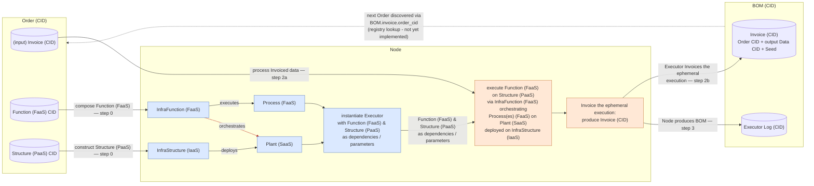

# CAT Node's Product Control-Feedback Loop:

## Activity Diagram:

## Control-Feedback Loop:
0. the "Node" consumes an "Order" containing an input "Invoice" of input data to be processed as well as the "Architectural Quantum's" functional domain components that process Invoiced data; The content of the Order CID to be processed by the Node's "Factory" consists of the following: (*)
    0A. the CID-ed input Invoice as is within `data/input/data/*`
    0B. the CID-ed Architectural Quantum's functional domain components:
        0Ba. "Function [FaaS]" consists of "Process [FaaS]" and Process' "InfraFunction [FaaS]" processing dependency
            * Function [FaaS] (as Code) is CID-ed for which the contents consist of CIDs for Procces [FaaS] and InfraFunction [FaaS]
        0Bb. "Structure [PaaS]" is Function's infrastructure dependency and consists of "Plant [SaaS]" and Plant's "InfraStructure [IaaS]" infrastructure dependency
            * Structure [PaaS] (as Code) is CID-ed for which the contents consist of Plant [SaaS] and InfraStructure [IaaS] CIDs
1. the Node's "Factory" processes an Order to produce "Executor" of an Architectural Quantum by composing 
    Function [FaaS], constructing Structure [PaaS], then instantiating Executors with Function [FaaS] & Structure [PaaS] as 
    its dependencies / parameters
2. the Executor is a composition of Architectural Quantum execution that executes and Invoices the ephemeral execution of the 
    Architectural Quantum.
    2a. the Executor executes the aforemention composition as a Function [FaaS] executing on Structure [PaaS] via InfraFunction [FaaS] orchestrating the execution of Process(es) [FaaS] on the Plant [SaaS] deployed on InfraStructure [IaaS]
    2b. the Executor Invoices the ephemeral execution of the Architectural Quantum by prodcuing a CID-ed Invoice containing the original CID-ed Order, an the CID-ed output Data, and a (non-deterministic proccessing) Seed (dictionary for Proccess(es) [FaaS])
3. the Node produces a CID-ed BOM containing an CID-ed Invoice and CID-ed Executor execution "logs" (*)

Notes (*):
    * 0. The Order is intended to be consumed from within a "BOM" hosted on a registry; i.e. - discovered via that BOM's "invoice.order_cid" - rather than supplied out-of-band; **this registry is not yet implemented**, such that the Node's `/cat/node/init` endpoint accepts the target `order_cid` directly as input today, standing in for the not-yet-built "look up a BOM on the registry, then consume its Order" step
    * 3 - CIDs of BOMs are intended to be published to the registry (0c) for future Orders to be consumed from